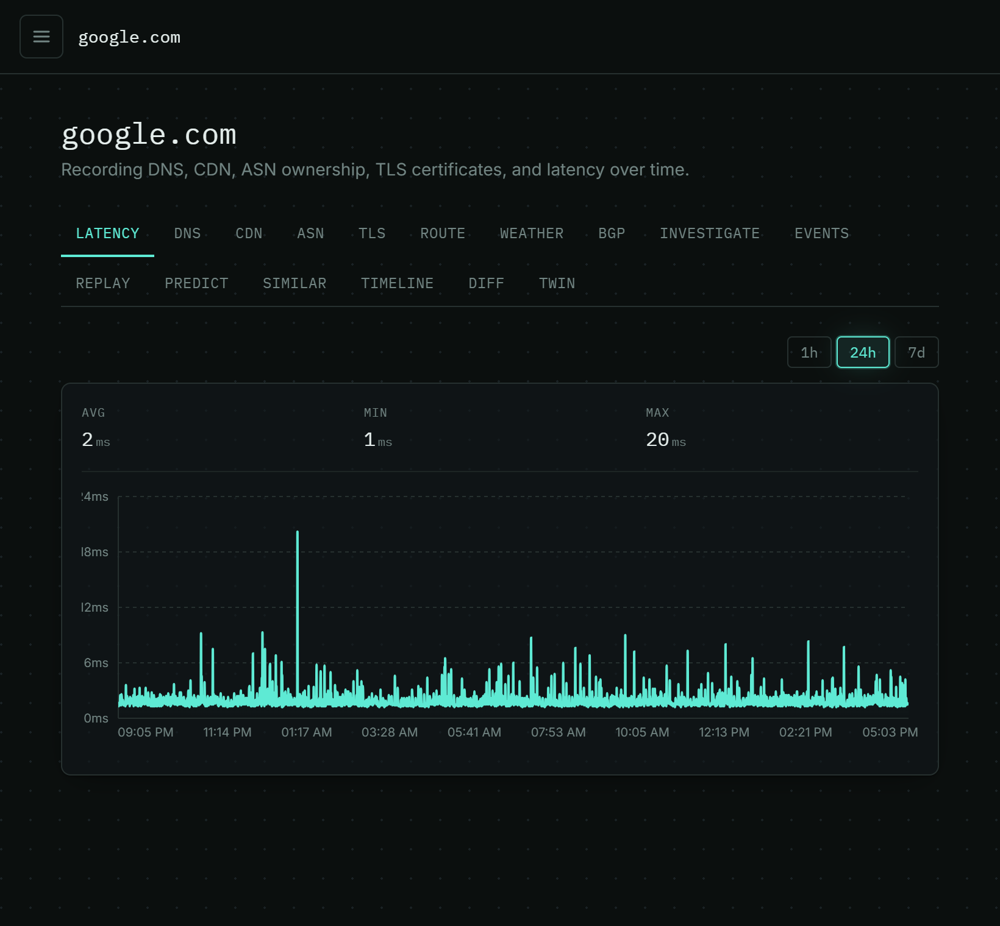
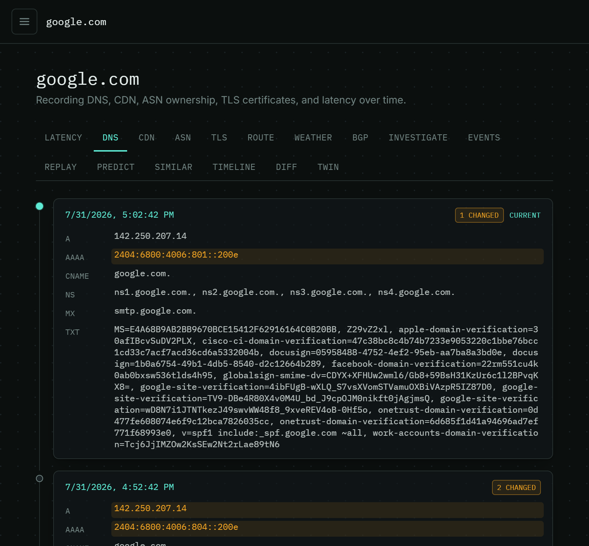
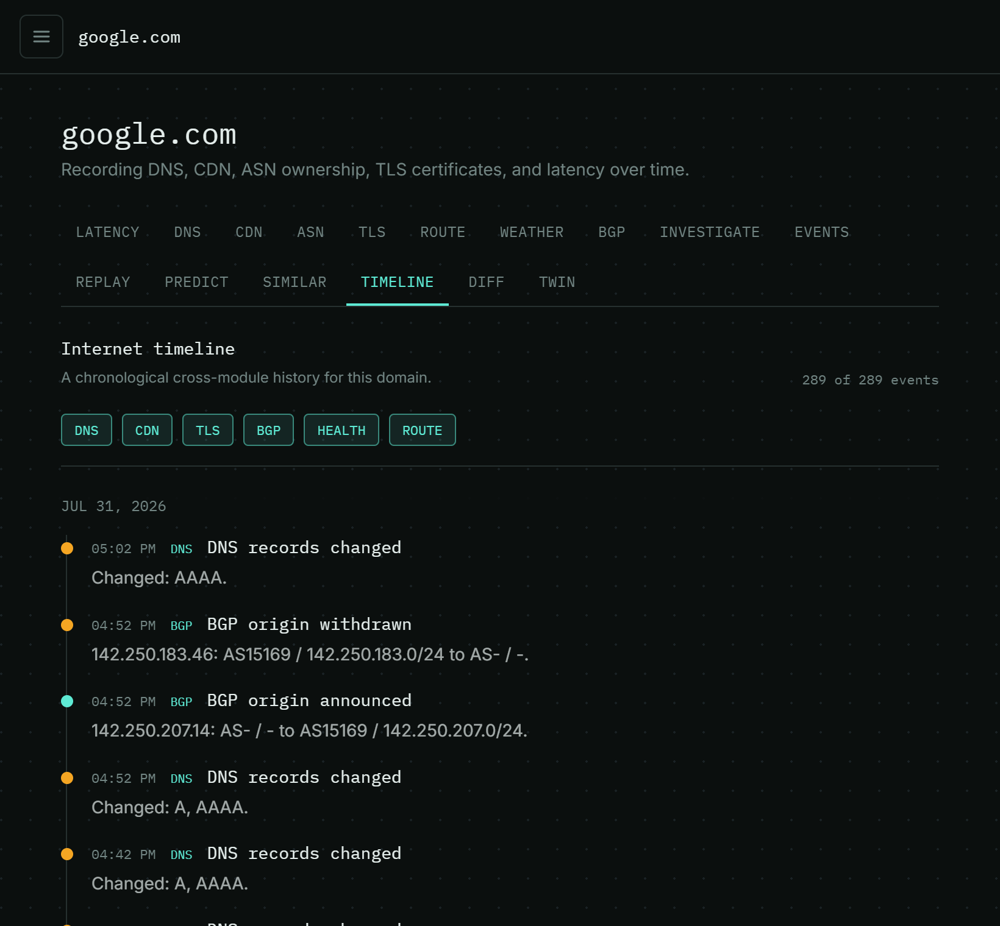
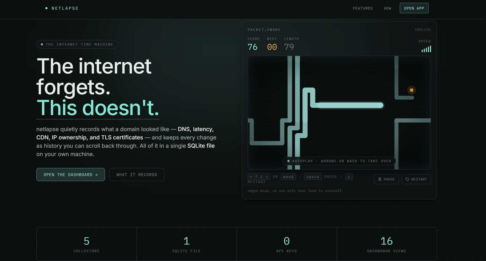
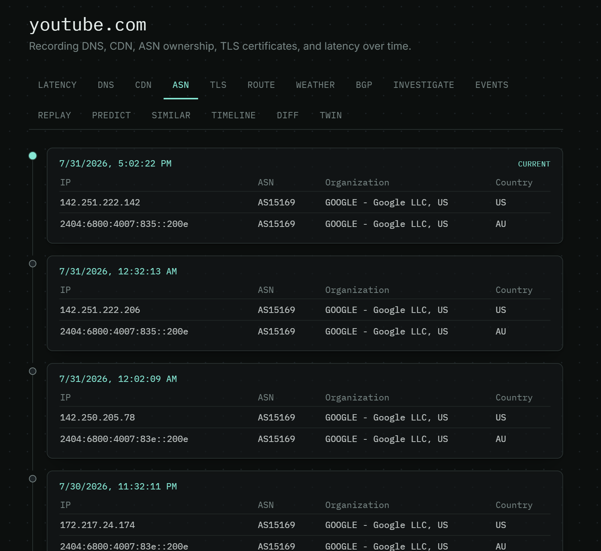
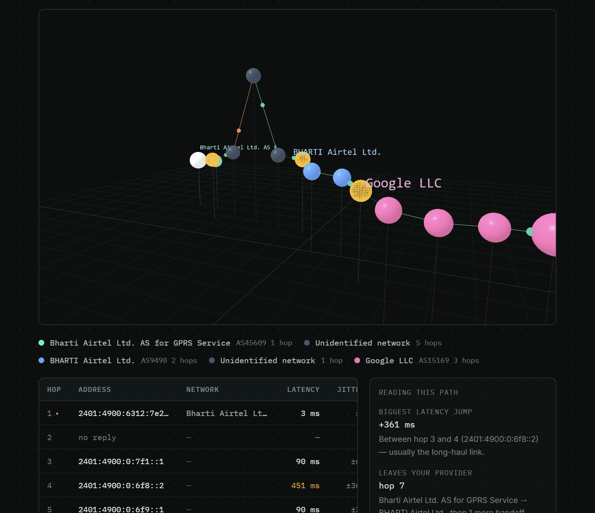
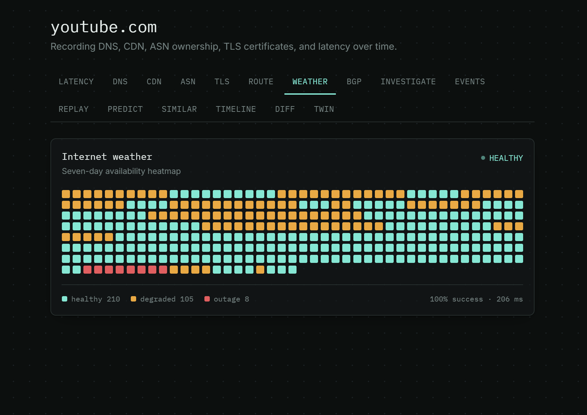

# netlapse

**The internet forgets. This doesn't.**

netlapse watches a website and writes down everything that changes about it —
its IP addresses, how fast it responds, which CDN serves it, who owns its
network, and its security certificate. Every change becomes history you can
scroll back through, like rewinding a video.

No account. No API keys. No cloud service. Everything is stored in a single
file on your own computer.


---

## Contents

1. [The problem it solves](#the-problem-it-solves)
2. [Screenshots](#screenshots)
3. [Setup guide](#setup-guide)
4. [How to use it](#how-to-use-it)
5. [What it records](#what-it-records)
6. [The dashboard views](#the-dashboard-views)
7. [Configuration](#configuration)
8. [Deploying to a server](#deploying-to-a-server)
9. [The API](#the-api)
10. [How it is built](#how-it-is-built)
11. [Troubleshooting](#troubleshooting)

---

## The problem it solves

Every monitoring tool will tell you whether a website is **up right now**.
Almost none will tell you **what it looked like last Tuesday**.

So when a site quietly switches CDN providers, or renews a certificate, or
Google rotates the IP address you had hard-coded in a config file, there is no
record of it. The evidence is already gone.

netlapse does the boring, useful opposite — it writes down what it sees and
keeps it:

```diff
  2026-07-31 04:32   DNS    A  142.251.42.110
+ 2026-07-31 04:42   DNS    A  142.250.207.14      <- address rotated
+ 2026-07-31 04:52   BGP    origin withdrawn       <- AS15169 stopped announcing it
+ 2026-07-31 16:15   TLS    serial changed         <- certificate was renewed
```

Leave it running for a week, then scrub back through the whole thing.

---

## Screenshots

<table>
  <tr>
    <td width="33%"></td>
    <td width="33%"></td>
    <td width="33%"></td>
  </tr>
  <tr>
    <td colspan="3"></td>
  </tr>
  <tr>
    <td width="33%"></td>
    <td width="33%"></td>
    <td width="33%"></td>
  </tr>
</table>

---

## Setup guide

Pick **one** of the two options below. Option A is for trying it out or working
on the code. Option B is one command if you already have Docker.

### What you need first

| Tool | Version | Check with | Get it |
|:--|:--|:--|:--|
| Go | 1.22 or newer | `go version` | [go.dev/dl](https://go.dev/dl/) |
| Node.js | 20.19+ or 22.12+ | `node --version` | [nodejs.org](https://nodejs.org/) |
| traceroute | any | `which traceroute` | Linux only — see the note below |

**Node 18 will not work.** Vite 8 refuses to install on it. If `node --version`
shows v18 or lower, upgrade before continuing.

**About traceroute.** Only the Route view needs it. Windows has `tracert` built
in, so nothing to do. macOS has `traceroute` built in. On Ubuntu or Debian run
`sudo apt install traceroute`. Every other feature works fine without it.

### Option A — run it locally

**Step 1 — get the code**

```bash
git clone https://github.com/BitByBit-101/netlapse.git
cd netlapse
```

**Step 2 — start the backend**

```bash
cd backend
go run ./cmd/server
```

Leave this terminal open. You should see a line like `netlapse API listening on
:8080`. The first run downloads Go dependencies, so give it a moment.

**Step 3 — start the frontend, in a second terminal**

```bash
cd frontend
npm install
npm run dev
```

`npm install` takes a minute or two the first time. When it finishes you will
see a `http://localhost:5173` link.

**Step 4 — open it**

Go to **http://localhost:5173** in your browser. That's it.

### Option B — run it with Docker

One command, nothing else to install:

```bash
docker compose up --build
```

Then open **http://localhost:8080**.

This builds both images and runs them together, with nginx serving the frontend
and forwarding `/api/` requests to the backend. Your recorded history lives in a
Docker named volume, so it survives `docker compose down` and rebuilds.

To stop it: `Ctrl+C`, or `docker compose down` from another terminal.

---

## How to use it

**1. Add a website.** Type a domain into the sidebar — `google.com`, no `https://`
— and press the **+** button.

**2. Wait.** Every collector takes its first snapshot immediately, so the views
fill in within seconds. But netlapse is about *change over time*, and change
takes time to happen.

**3. Come back later.** Leave it running overnight. `google.com` rotates its IP
addresses every few minutes, so by morning the DNS timeline will have dozens of
real changes in it. This is when the tool becomes interesting — after an hour
you have a chart, after a week you have history.

> **Tip:** add two or three domains. The **Similar** view compares them and finds
> which ones share infrastructure.

---

## What it records

Seven collectors run independently, each on its own schedule.

| Collector | What it captures | How often | When it saves |
|:--|:--|:--|:--|
| **DNS** | A, AAAA, CNAME, NS, MX and TXT records | 10 min | only when changed |
| **CDN** | Which CDN serves the site, out of 13 known providers | 15 min | only when changed |
| **ASN** | Which company owns each IP address | 30 min | only when changed |
| **TLS** | Certificate issuer, serial, validity dates and cipher | 30 min | only when renewed |
| **Latency** | Response time, measured by a TCP connection to port 443 | 30 sec | every time |
| **Health** | healthy / degraded / outage, over a 15-minute window | 2 min | every time |
| **Route** | Every network hop between you and the site | 6 hours | every time |

The first four save **only when something actually changed**, so their timelines
read like a list of events rather than thousands of identical rows.

**BGP events** — when a network starts or stops announcing an IP range — are
worked out by comparing ASN snapshots. No BGP feed subscription needed.

---

## The dashboard views

Sixteen tabs, all reading the same recorded history.

| View | What it shows |
|:--|:--|
| **Latency** | Response time over 1 hour, 24 hours or 7 days |
| **DNS** | Every DNS record change, with the changed fields highlighted |
| **CDN** | When the site switched CDN provider |
| **ASN** | When ownership of its IP addresses changed |
| **TLS** | Every certificate renewal |
| **Route** | The network path, hop by hop, with packet loss per hop |
| **Weather** | A seven-day availability heatmap |
| **BGP** | Network announcement and withdrawal events |
| **Investigate** | Automatic findings, each linked to the data behind it |
| **Events** | Everything above, merged into one feed |
| **Replay** | Scrub through history, or auto-play it at 0.5× to 4× speed |
| **Predict** | A latency forecast, with an honest confidence score |
| **Similar** | Other tracked domains sharing the same infrastructure |
| **Timeline** | Everything in date order, filterable by type |
| **Diff** | Compare any two moments in time, field by field |
| **Twin** | The network path drawn in 3D |

A few work harder than they sound:

- **Replay** remembers your position by event, not by scroll offset, so the
  15-second refresh never jumps you somewhere else mid-scrub. Arrow keys, Home
  and End all work.
- **Diff** looks up each signal *as it was* at the moment you picked, so a
  slow-updating collector is never mistaken for something that changed.
- **Predict** reports r² and a confidence range that widens the further out it
  looks. If the data is too noisy to support a trend it says so instead of
  drawing a confident wrong line.
- **Investigate** runs entirely on your machine. Optionally it can add a short
  written summary through a local AI model — see [Configuration](#configuration).
- **Twin** groups consecutive hops in the same network into labelled lanes:
  left-to-right is hop order, height is latency, depth is the network.

---

## Configuration

Everything is optional. The defaults work.

### Backend

Set these as environment variables before starting the server:

| Variable | Default | What it does |
|:--|:--|:--|
| `NC_DB_PATH` | `netlapse.db` | Where the history file is written |
| `NC_ADDR` | `:8080` | Address and port to listen on |
| `NC_DNS_INTERVAL` | `10m` | How often to check DNS |
| `NC_LATENCY_INTERVAL` | `30s` | How often to measure latency |
| `NC_CDN_INTERVAL` | `15m` | How often to check the CDN |
| `NC_ASN_INTERVAL` | `30m` | How often to check IP ownership |
| `NC_TLS_INTERVAL` | `30m` | How often to check the certificate |
| `NC_ROUTE_INTERVAL` | `6h` | How often to trace the network path |
| `NC_HEALTH_INTERVAL` | `2m` | How often to roll up health |

Example — check DNS every minute instead of every ten:

```bash
NC_DNS_INTERVAL=1m go run ./cmd/server
```

### Optional AI summaries

The Investigate view can add a two-to-four sentence written summary. It is off
by default. To turn it on:

| Variable | Default | What it does |
|:--|:--|:--|
| `NC_LLM_ENABLED` | `false` | Set to `true` to enable summaries |
| `NC_LLM_URL` | Ollama's local address | Any OpenAI-compatible endpoint |
| `NC_LLM_MODEL` | — | Which model to use |
| `NC_LLM_API_KEY` | — | Only needed for hosted services |

Only the domain name and the findings are sent — never your database. If the
model is unreachable the report still works, just without the summary.

### Frontend

`VITE_API_URL` tells the frontend where the API is. It is baked in when the
frontend is **built**, not when it runs:

- **Leave it unset** for local development — it uses `http://localhost:8080`.
- **Set it to an empty string** when the frontend and API share one address
  behind a reverse proxy. Requests then go to relative `/api/...` paths.

---

## Deploying to a server

| Method | Best for |
|:--|:--|
| `go run` + `npm run dev` | Working on the code |
| `docker compose up --build` | The simplest real deployment |
| nginx + systemd | A normal Linux server |
| `deploy/build-bundle.sh` | Deploying to a cloud VM such as EC2 |

### Deploying to a Linux server

**Step 1 — build the bundle on your machine:**

```bash
./deploy/build-bundle.sh
```

This produces `deploy/netlapse-bundle.tar.gz`, containing a self-contained
Linux binary and the built frontend.

**Step 2 — copy it to the server and install:**

```bash
scp -i key.pem deploy/netlapse-bundle.tar.gz ubuntu@YOUR_SERVER:~
ssh -i key.pem ubuntu@YOUR_SERVER \
  'tar xzf netlapse-bundle.tar.gz && sudo bash netlapse-bundle/provision.sh'
```

`provision.sh` installs the service, sets up nginx, and starts everything. It is
safe to run again — re-running it is how you deploy an update, and it never
touches your database.

**Step 3 — add HTTPS (optional):**

```bash
sudo bash setup-domain.sh your-domain.com you@example.com
```

This checks your DNS really points at the server *before* requesting a
certificate, so you don't waste one of Let's Encrypt's five weekly attempts. Add
`--staging` to rehearse it first.

**Step 4 — close SSH (optional):**

```bash
./deploy/setup-ssm.sh
```

Replaces SSH access with AWS Session Manager so port 22 can be closed to the
internet entirely. It shows you what it would change and does nothing until you
add `--apply`, and it refuses to close port 22 until it has confirmed the
replacement works. It can also release unused Elastic IP addresses you are being
billed for.

---

## The API

Everything returns JSON. Errors look like `{"error": "..."}`. There is no
authentication, so bind it to localhost and put nginx in front.

```bash
# list tracked domains
curl localhost:8080/api/domains

# add one
curl -X POST localhost:8080/api/domains -d '{"domain":"github.com"}'

# remove one, and all its history
curl -X DELETE localhost:8080/api/domains/github.com
```

| Endpoint | Returns |
|:--|:--|
| `GET /api/domains` | Every tracked domain |
| `POST /api/domains` | Adds a domain and takes the first snapshot |
| `DELETE /api/domains/{domain}` | Deletes it and all its history |
| `GET /api/history/dns/{domain}` | DNS history, oldest first |
| `GET /api/history/cdn/{domain}` | CDN history |
| `GET /api/history/asn/{domain}` | IP ownership history |
| `GET /api/history/tls/{domain}` | Certificate history |
| `GET /api/history/route/{domain}` | Network path history |
| `GET /api/history/latency/{domain}?since_hours=24` | Latency samples |
| `GET /api/history/health/{domain}?since_hours=168` | Availability |
| `GET /api/history/bgp/{domain}` | BGP events, newest first |
| `GET /api/events/{domain}?since_hours=168` | Everything merged, newest first |
| `GET /api/investigate/{domain}` | Findings, plus a summary if enabled |
| `GET /api/predict/{domain}` | Latency forecast with r² |
| `GET /api/similar/{domain}` | Domains ranked by shared infrastructure |

---

## How it is built

**Backend** — Go 1.22 using only the standard library for HTTP, plus
[modernc.org/sqlite](https://modernc.org/sqlite), a SQLite driver written in
pure Go. That means no C compiler is needed and `CGO_ENABLED=0` produces one
static binary that runs anywhere. Each collector is a goroutine on its own
ticker.

**Frontend** — React 18 and TypeScript in strict mode, built with Vite 8 and
styled with Tailwind. Charts use Recharts; the 3D view uses three.js. Routing is
done with URL hashes and no router library, so any static file host can serve it
without special configuration. The two heaviest views load on demand, which
keeps the initial download at 253 kB (75 kB compressed) instead of 1.2 MB.

**Project layout**

```
backend/
  cmd/server/           entry point and collector scheduling
  internal/storage/     SQLite schema and all queries
  internal/collector/   the seven collectors
  internal/api/         HTTP handlers
  internal/events/      merges every signal into one feed
  internal/investigator/  finds notable changes
  internal/predictor/   latency forecasting
  internal/similarity/  compares domains
  internal/llm/         optional AI summaries

frontend/src/
  App.tsx               dashboard shell and routing
  Landing.tsx           landing page
  api.ts                typed API client
  components/           the sixteen views

deploy/                 build, provision and HTTPS scripts
```

---

## Troubleshooting

**`npm install` fails with an engine or version error.**
Your Node is too old. Vite 8 needs 20.19+ or 22.12+. Check with
`node --version` and upgrade.

**The dashboard loads but every view is empty.**
The backend probably isn't running. Check that terminal — you should see
`netlapse API listening on :8080`. Then confirm it answers:
`curl localhost:8080/api/domains`.

**The Route view shows an error on every hop.**
`traceroute` isn't installed. On Ubuntu or Debian: `sudo apt install
traceroute`. Windows and macOS already have it.

**The charts look empty or nearly flat.**
There isn't enough history yet. Latency needs a few minutes, DNS changes need
longer. Leave it running.

**Port 8080 or 5173 is already in use.**
Change the backend port with `NC_ADDR=:9090 go run ./cmd/server`. For the
frontend, edit `server.port` in `frontend/vite.config.ts`.

**Where is my data?**
`backend/netlapse.db`, unless you set `NC_DB_PATH`. It is an ordinary SQLite
file — copy it to back it up, delete it to start fresh. Under Docker it lives in
a named volume instead.

---

## Roadmap

Alert rules · CSV and JSON export · WHOIS and registrar history · per-domain
retention settings · collecting from more than one region.

---

Built to answer one question: **what did the internet look like yesterday?**
